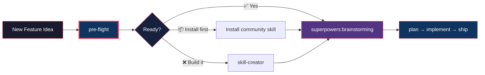
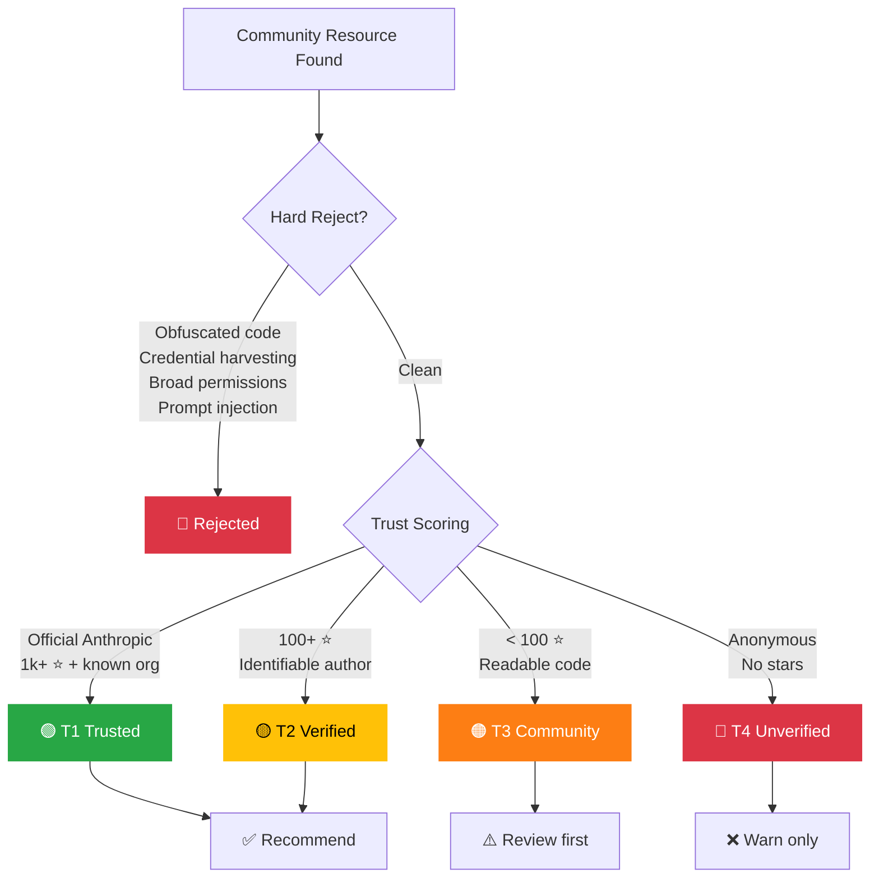
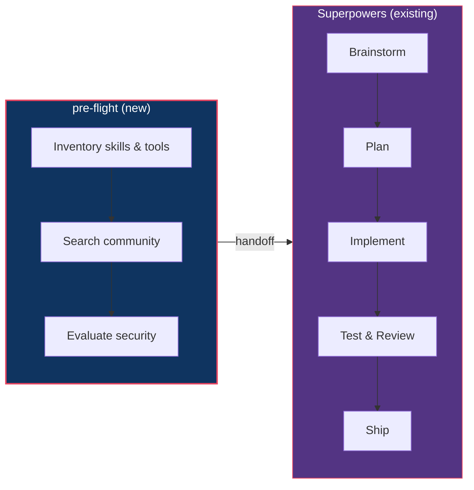

<div align="center">

# pre-flight

**Stop building what already exists. Start every feature with a capability check.**

A [Claude Code](https://code.claude.com) skill that assesses your readiness before starting new work.
Complements [Superpowers](https://github.com/obra/superpowers) — runs **before** brainstorming to ensure the right tools are in place.

[English](README.md) | [中文](README.zh-CN.md)

</div>

---

## The Problem

You're about to build a feature. You fire up Claude Code, start brainstorming, write a plan, implement it...

Then discover someone already built a skill for exactly this. Or worse — you install a community plugin that quietly exfiltrates your `.env`.

**pre-flight** fixes both problems in one step.

## How It Works



Three questions, answered automatically:

| Question | How |
|----------|-----|
| **Do I have the tools?** | Scans installed skills, plugins, MCP servers |
| **Has someone built this?** | Searches community marketplaces & GitHub |
| **Is it safe?** | Security-first evaluation with 4-tier trust system |

## Security-First Trust System

Every community resource goes through evaluation before recommendation:



Full rubric: [evaluation-criteria.md](references/evaluation-criteria.md)

## Install

```bash
# Personal (available in all projects)
git clone https://github.com/TaliesinYang/pre-flight-skill ~/.claude/skills/pre-flight

# Project-scoped
git clone https://github.com/TaliesinYang/pre-flight-skill .claude/skills/pre-flight
```

## Usage

```bash
/pre-flight implement OAuth2 with JWT refresh tokens
/pre-flight add PDF export feature
/pre-flight build a real-time notification system
```

Or just describe what you want to build — Claude auto-triggers it when relevant.

## Example Output

```markdown
## Pre-Flight Report: real-time notification system

### Environment Readiness
| Area       | Status | Details                              |
|------------|--------|--------------------------------------|
| Skills     | ⚠️     | No WebSocket-specific skill found    |
| MCP Tools  | ✅     | Playwright available for E2E testing |
| Codebase   | ✅     | Express server exists, can extend    |

### Community Resources Found
| Resource                  | Type   | Trust | Stars | Notes                    |
|---------------------------|--------|-------|-------|--------------------------|
| superpowers               | Plugin | 🟢    | 40k+  | Dev workflow (installed)  |
| levnikolaevich/ws-skill   | Skill  | 🟡    | 340   | WebSocket patterns        |
| socketio/socket.io        | Repo   | 🟢    | 60k+  | Reference implementation  |

### Recommended Path
📦 Install `ws-skill`, then proceed to `superpowers:brainstorming`

### Gaps & Risks
- No push notification service integration found
```

## Where It Fits



**pre-flight** owns the "before" — Superpowers owns the "during". No overlap, full coverage.

## Design Principles

| Principle | What it means |
|-----------|--------------|
| **Complementary** | Never replaces Superpowers or any other skill |
| **Tool-agnostic** | Uses whatever search tools you have; works offline with bundled index |
| **Read-only** | Never installs or executes community code — decisions are yours |
| **Security-first** | When in doubt, flags it 🔴 |

## Enhanced Search (Optional)

Works offline with a [bundled skill registry](references/skill-registry.md). For richer results, add any web search MCP:

- Perplexity MCP (recommended)
- WebSearch (built-in with Claude Max)
- Any MCP providing web search

## Structure

```
pre-flight/
├── SKILL.md                          # Core skill instructions
└── references/
    ├── evaluation-criteria.md        # Security evaluation rubric
    └── skill-registry.md             # Offline fallback index
```

## License

MIT

---

<div align="center">

Built with Claude Code. Designed to complement, not compete.

</div>
