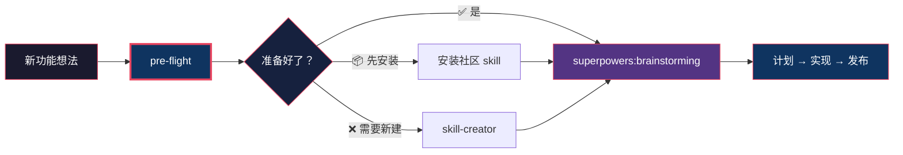
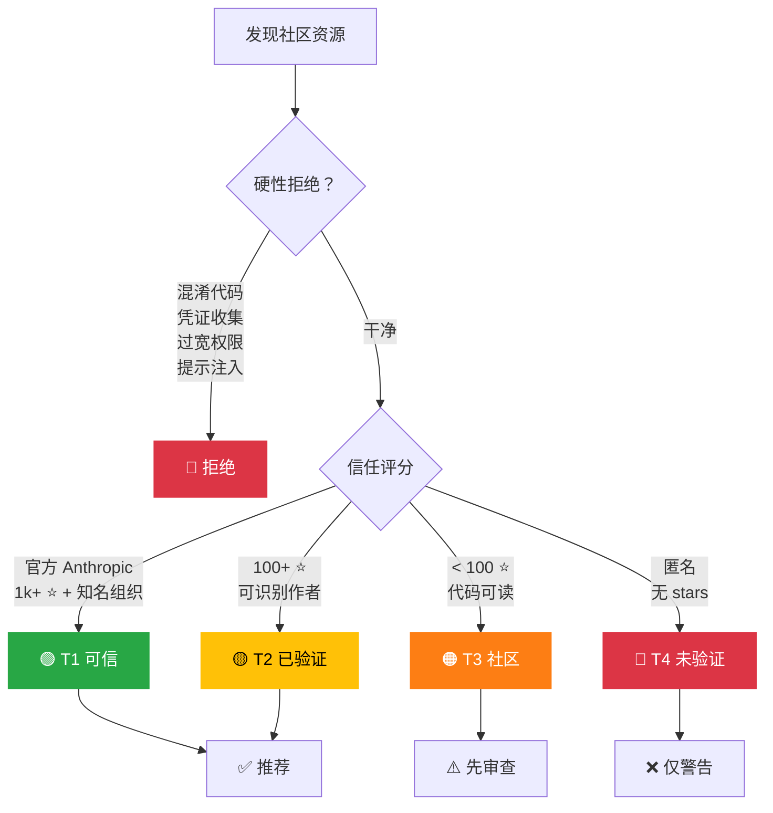
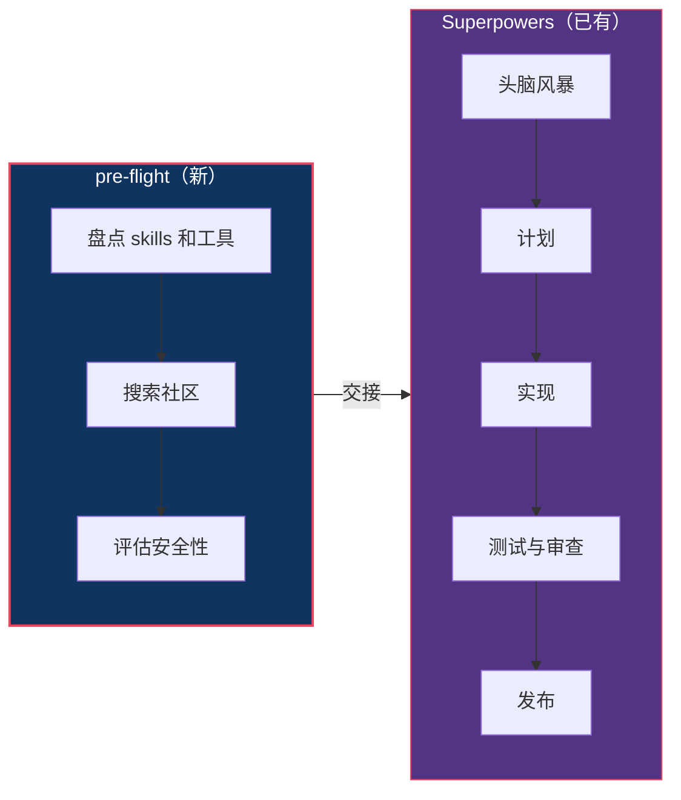

<div align="center">

# pre-flight

**别再重复造轮子。每个新功能，从能力检查开始。**

一个 [Claude Code](https://code.claude.com) 技能，在开始新工作前评估你的准备状态。
与 [Superpowers](https://github.com/obra/superpowers) 互补 — 在头脑风暴**之前**运行，确保工具就位。

[English](README.md) | [中文](README.zh-CN.md)

</div>

---

## 问题

你准备做一个功能。打开 Claude Code，开始头脑风暴，写计划，实现……

然后发现社区早就有人做好了。更糟的是——你装了一个社区插件，它悄悄读取了你的 `.env`。

**pre-flight** 一步解决这两个问题。

## 工作原理



三个问题，自动回答：

| 问题 | 方式 |
|------|------|
| **我有工具吗？** | 扫描已安装的 skills、plugins、MCP servers |
| **社区有人做过吗？** | 搜索技能市场和 GitHub |
| **安全吗？** | 安全优先评估 + 4 级信任体系 |

## 安全优先信任体系

每个社区资源在推荐前必须通过评估：



完整评估标准：[evaluation-criteria.md](references/evaluation-criteria.md)

## 安装

```bash
# 个人技能（所有项目可用）
git clone https://github.com/TaliesinYang/pre-flight-skill ~/.claude/skills/pre-flight

# 项目级别
git clone https://github.com/TaliesinYang/pre-flight-skill .claude/skills/pre-flight
```

## 使用

```bash
/pre-flight 实现 OAuth2 + JWT 刷新令牌
/pre-flight 添加 PDF 导出功能
/pre-flight 构建实时通知系统
```

也可以直接描述你要做什么——Claude 会在相关时自动触发。

## 示例输出

```markdown
## Pre-Flight 报告：实时通知系统

### 环境准备度
| 领域       | 状态 | 详情                              |
|------------|------|-----------------------------------|
| Skills     | ⚠️   | 未找到 WebSocket 专用 skill        |
| MCP Tools  | ✅   | Playwright 可用于 E2E 测试         |
| Codebase   | ✅   | 已有 Express 服务器，可扩展        |

### 社区资源
| 资源                      | 类型   | 信任 | Stars | 备注                    |
|---------------------------|--------|------|-------|------------------------|
| superpowers               | Plugin | 🟢   | 40k+  | 开发工作流（已安装）     |
| levnikolaevich/ws-skill   | Skill  | 🟡   | 340   | WebSocket 模式          |
| socketio/socket.io        | Repo   | 🟢   | 60k+  | 参考实现                |

### 推荐路径
📦 安装 `ws-skill`，然后进入 `superpowers:brainstorming`

### 缺口与风险
- 未找到推送通知服务集成
```

## 它的位置



**pre-flight** 负责"之前"——Superpowers 负责"之中"。零重叠，全覆盖。

## 设计原则

| 原则 | 含义 |
|------|------|
| **互补** | 不替代 Superpowers 或任何其他技能 |
| **工具无关** | 使用你有的任何搜索工具；离线也能用 |
| **只读** | 不安装不执行社区代码——决定权在你 |
| **安全优先** | 有疑虑就标 🔴 |

## 增强搜索（可选）

自带[离线技能索引](references/skill-registry.md)。安装任意搜索 MCP 可获得更丰富结果：

- Perplexity MCP（推荐）
- WebSearch（Claude Max 内置）
- 任何提供网络搜索的 MCP

## 结构

```
pre-flight/
├── SKILL.md                          # 核心技能指令
└── references/
    ├── evaluation-criteria.md        # 安全评估标准
    └── skill-registry.md             # 离线备用索引
```

## 许可证

MIT

---

<div align="center">

用 Claude Code 构建。设计为互补，而非竞争。

</div>
